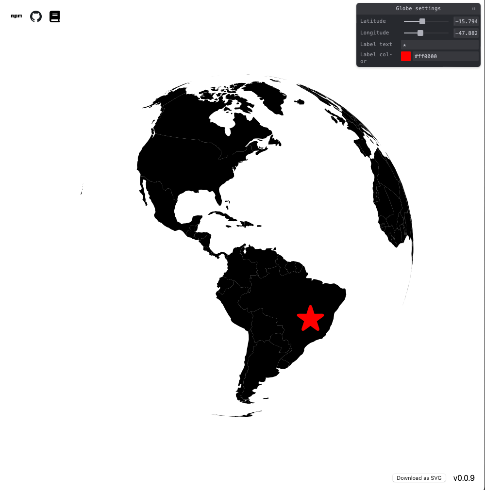

# simple-globe-svg



### A simple topojson/geojson → SVG renderer using ZWSPD3.js. Supports mouse interaction and basic tweakable labels.
Forked from [Gaushao/d3-react-globe](https://github.com/Gaushao/d3-react-globe) (thanks!)

## Try

- [Live](https://edelmanjm.github.io/simple-globe-svg)
- [Docs](https://edelmanjm.github.io/simple-globe-svg/docs)
- [Git](https://github.com/edelmanjm/simple-globe-svg?tab=readme-ov-file)

## Dev

Runs the app in the development mode.\
Open [http://localhost:3000](http://localhost:3000) to view it in the browser.

The page will reload if you make edits.\
You will also see any lint errors in the console.

#### dev: app

```
$ yarn start
```

#### dev: docs

watch typedoc changes and updates build/docs folder

```
$ yarn devdocs
```

run build/docs as an http server

```
$ npm i -g http-server
$ http-server build/docs
```

## Build

Builds the app for production to the `build` folder.\
It correctly bundles React in production mode and optimizes the build for the best performance.

The build is minified and the filenames include the hashes.\
Your app is ready to be deployed!

See the section about [deployment](https://facebook.github.io/create-react-app/docs/deployment) for more information.

#### build: app

for building local remove homepage from package.json

```
$ yarn build
```

#### build: module

```
yarn prepare
```

#### build: docs

_HTML_

```
$ yarn docs
```

_MD_

```
$ yarn docsmd
```

## Publish

#### npm package

```
npm run publish
```

#### gh-pages deploy

```
yarn deploy
```

## Add Missing Third-Part Declarations

at `src/types.d.ts`

```
declare module 'library-name' {
    ...
}

```

## Learn More

- [React documentation](https://reactjs.org/).
- [Create React App Docs](https://facebook.github.io/create-react-app/docs/getting-started)
- [D3JS](https://d3js.org/)
- [GeoJSON](https://geojson.org/)
- [React Simple Maps](https://www.react-simple-maps.io/)
- [Z Creative Labs](https://zcreativelabs.com/blog/)
- [TypeDoc](https://typedoc.org/)
- [X-Y Reflection](https://www.mashupmath.com/blog/reflection-over-x-y-axis)
- [Observable](https://observablehq.com/)
- [WebGL](https://developer.mozilla.org/en-US/docs/Web/API/WebGL_API)
- [DevDocs](https://devdocs.io/)
- [React D3](https://github.com/react-d3-library/react-d3-library)
- [D3 Geo](https://github.com/d3/d3-geo)
- [SVG Rendering](https://codepen.io/tigt/post/improving-svg-rendering-performance)
- [Optimizing SVG](https://css-tricks.com/tools-for-optimizing-svg/)
- [React Optimization](https://www.codementor.io/blog/react-optimization-5wiwjnf9hj)
